# CHAPTER TWO IS OUT NOW!

- Trailer: [Chapter Two Trailer](https://youtu.be/gQi54Pd_SWE)
  <iframe width="560" height="315" src="https://www.youtube.com/embed/gQi54Pd_SWE?si=0Ev8s-_UhVt7uP5d" title="YouTube video player" frameborder="0" allow="accelerometer; autoplay; clipboard-write; encrypted-media; gyroscope; picture-in-picture; web-share" referrerpolicy="strict-origin-when-cross-origin" allowfullscreen></iframe>

# Modules

## Discord Module

- Tutorial: [Discord Module Setup Guide](https://youtu.be/YQiYSjEcdMk)
  <iframe width="500" height="300" src="https://www.youtube.com/embed/YQiYSjEcdMk" title="Discord Module Setup Guide | YVtils SMP &amp; YVtils DC | A Step-by-Step Guide" frameborder="0" allow="accelerometer; autoplay; clipboard-write; encrypted-media; gyroscope; picture-in-picture; web-share" allowfullscreen></iframe>

- Chat Sync

  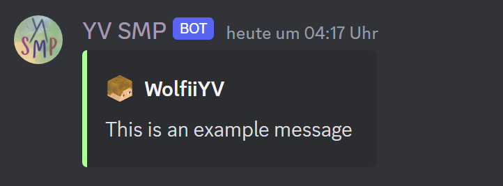
- Minecraft Server Stats

  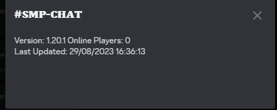
  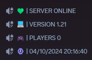
- Console Sync

  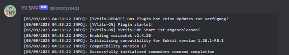
- Whitelist with Discord

## Status Module

`/status set <status>`
`/status default <status>`
`/status clear [player]`

Let players set a status before their name.

## Sit Module

`/sit`

Let players sit down everywhere.

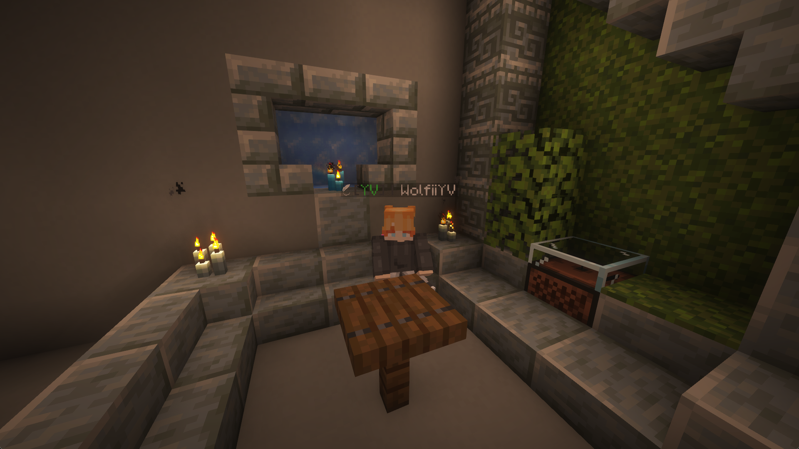

## Extended Vanish Module

`/v [quick]`

- Silent Container Interaction
- No Mob Targeting
- Ignore dropped items
- Layer System
    - Higher Layer Players can see Lower Layer Players, but not vice versa.

## Moderation Module

- Ban Command `/ban <player> [reason]`
- Tempban Command `/tempban <player> <time> <unit> [reason]`
- Kick Command `/kick <player> [reason]`
- Mute Command `/mute <player> [reason]`
- Tempmute Command `/tempmute <player> <time> <unit> [reason]`
- Unban Command `/unban <player>`
- Unmute Command `/unmute <player>`

## Fusion Module / Custom Crafting

`/fusion [manage]`

- Let players craft custom items
    - Invisible Item Frames

      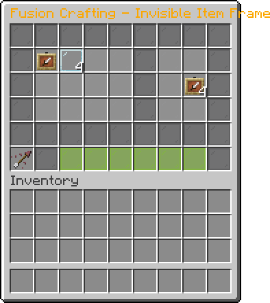

    - Light Blocks

      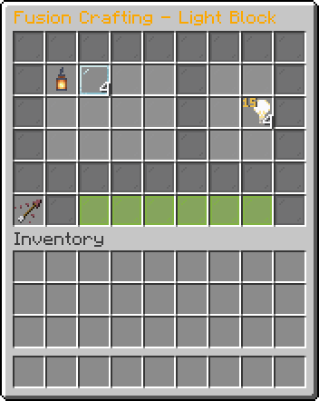

    - Custom Player Heads

      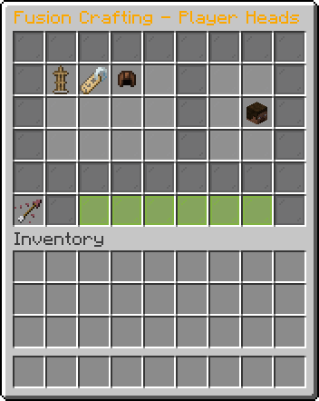

- Manange existing or create new fusions

  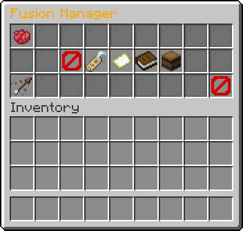

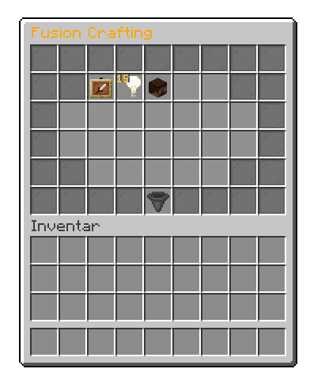

## MultiMine Module (VeinMiner & Timber)

`/mm add [block]`
`/mm addMultiple`
`/mm remove [block]`
`/mm removeMultiple`

- MultiMine Blocks
- Add/Remove multiple blocks at once with a contaimer in your hand

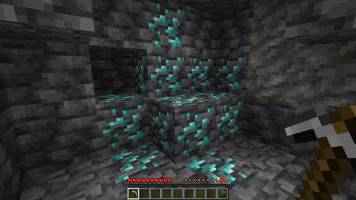
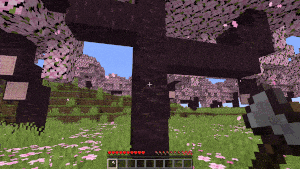

## Server Module

- Maintenance Mode
- Custom MOTD

  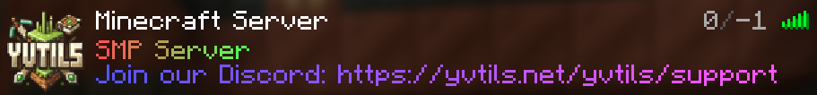
- Fake Max Player Count
- Customizable Player Info Text

  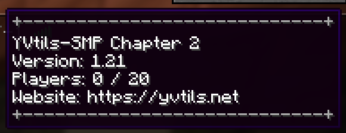

## Waypoints Module

`/waypoint <naviagte/create/delete> <name> [visibility]`

- Create waypoints with visibilities
    - Public - Everyone can see it
    - Private - Only you can see it
    - Unlisted - Only you can see it, but others can navigate to it
- Navigate to waypoints

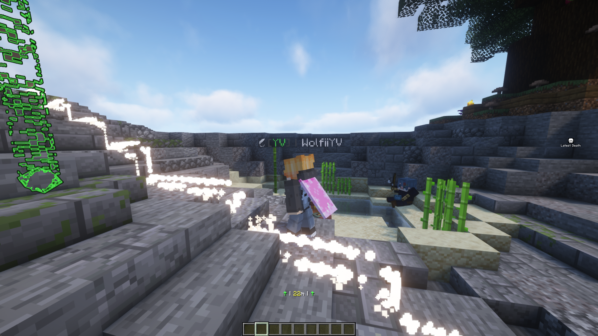

## Other Features

- Anti Too Expensive
    - Bypasses the "Too Expensive" Enchantment Limit

  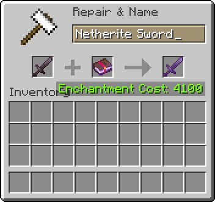

- MSG System
    - `/msg <player> <message>`
    - `/r <message>`

  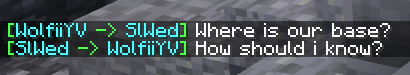

- Spawn Elytra

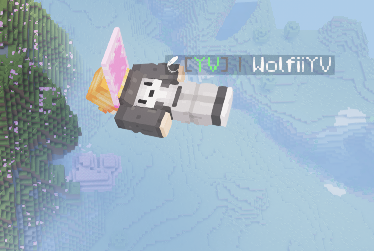

# Commands
- Fly Command `/fly [player]`
- Heal Command `/heal [player]`
- Speed Command `/speed <speed> [player]`
- God Command `/god [player]`
- GlobalMute Command `/gmute [state]`
- Gamemode Command `/gm <gamemode> [player]`
- Seed Command `/seed show`

# Other

## Smart Language System

- [Request Features](https://github.com/YV-Network/YVtils-SMP/issues/new?assignees=&labels=feature+request&template=feature_request.md&title=) or
  [Discord](https://discord.gg/qHpMsduU7p)
- [Requested Features](http://padlet.com/WolfiiYV/yvtilssmp)
